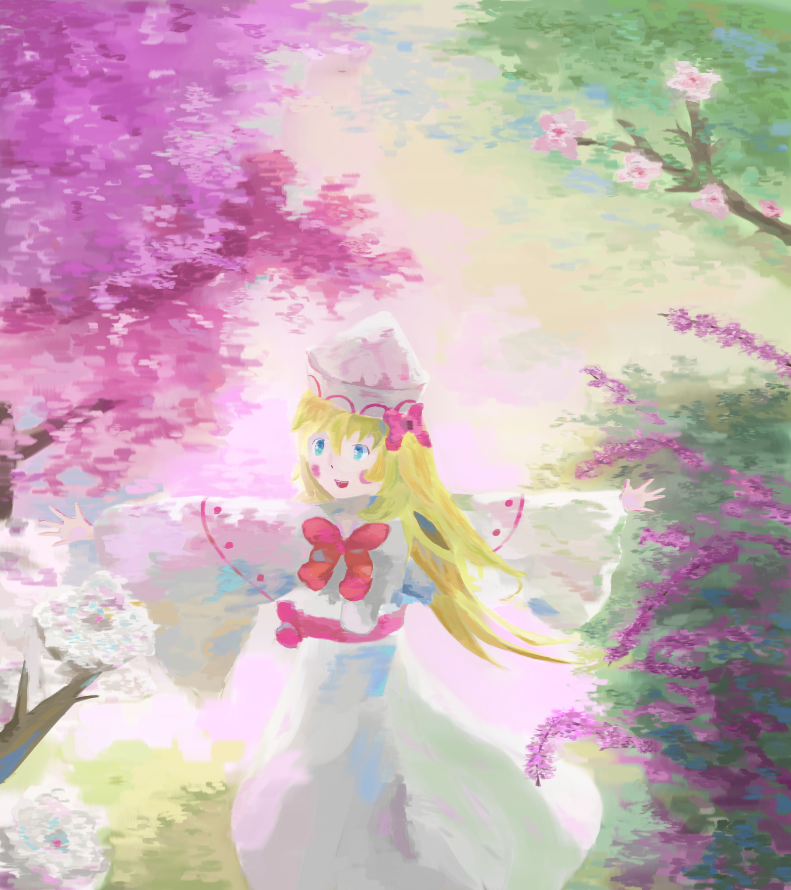

## 缺陷
### 画面整体偏亮，对比度不高
主要原因：前期，希望能将最终结果保持清新的氛围，不敢添加太多的阴影
次要原因：ThinkPad X1 Carbon 2018的屏幕素质很差，最大亮度不高，导致为了作画时肉眼获得足够明度，将亮度调整的过高。在这块屏幕上画出来的画，在别的稍微素质高一些的屏幕上就会过亮，同时暗部的亮度也会略微提高。

### 花费了太多，太多的时间
虽然我仍然处于起步阶段，但是一张画最少也要花费一周的时间，这实在是太长了。到最后两天的时候，我总是会对这幅画感到厌烦，希望能够尽快收尾，然后放弃一些尚未完成的细化，草草了事。

